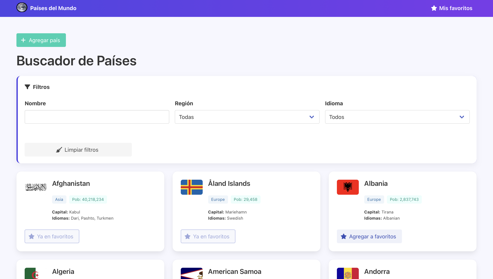
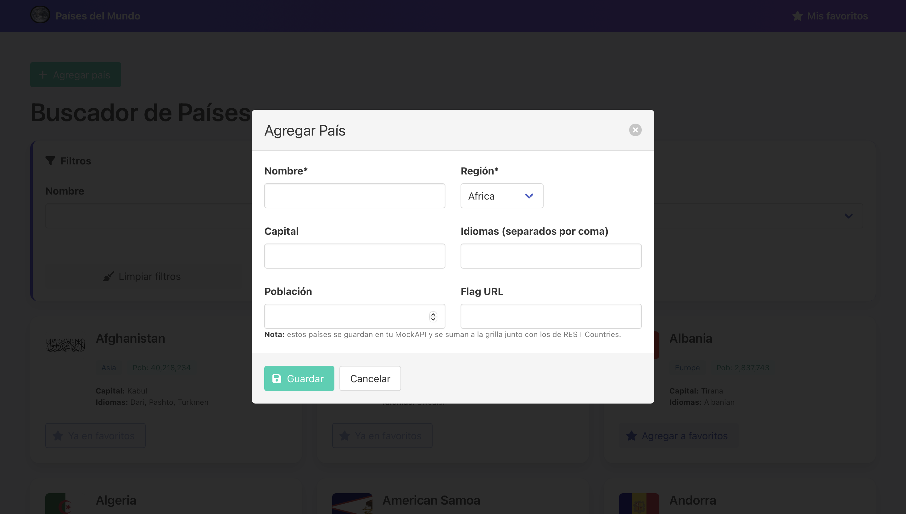
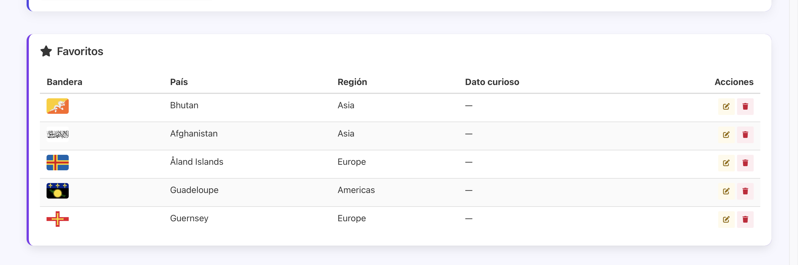
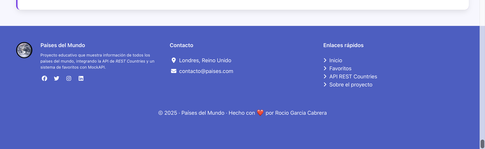

# TP-FRONTEND-MODULO 3
# 🌍 Países del Mundo · Buscador + Favoritos

Proyecto práctico de Frontend que consume la API de **REST Countries** para mostrar información de todos los países del mundo.  
Permite filtrar, agregar a favoritos y añadir un **dato curioso** a cada país usando **MockAPI** como base de datos.

---

## 🚀 Tecnologías utilizadas
- **HTML5**  
- **CSS3** con [Bulma](https://bulma.io/)  
- **JavaScript**  
- **Font Awesome** para iconos  
- **REST Countries API** → [https://restcountries.com](https://restcountries.com)  
- **MockAPI** → para la gestión de favoritos  

---

## 📂 Estructura del proyecto
├── index.html      # Página principal

├── app.js          # Lógica con fetch, filtros y favoritos

├── README.md       # Documentación del proyecto


---

## ⚙️ Funcionalidades

✅ Mostrar todos los países en tarjetas con bandera, región, capital, idiomas y población  
✅ Filtrar por nombre, región o idioma en tiempo real  
✅ Crear y agregar nuevo país a la lista  
✅ Agregar y eliminar países de favoritos  
✅ Editar un dato curioso para cada país favorito (guardado en MockAPI)  
✅ Interfaz con Bulma y Font Awesome  
✅ Footer con información de contacto, enlaces rápidos y redes sociales    

---

## 🖼️ Capturas de pantalla

### 📌 Página principal


### ➕ Crear país


### ⭐ Favoritos


### 📑 Pie de página



---

## 🔑 Cómo usarlo
1. Clonar el repositorio:
   ```bash
   git clone https://github.com/usuario/paises-del-mundo.git
   cd paises-del-mundo
2.	Abrir index.html en el navegador.

3.	Configurar tu URL de MockAPI en app.js:
const MOCKAPI_URL = "https://tu-mockapi.io/api/v1/favorites";

4.	Listo ✅ ya podés buscar, filtrar y guardar favoritos.

---

👩‍💻 Autora

Proyecto desarrollado por Rocío Garcia Cabrera
💜 Hecho con HTML, Bulma y JavaScript.
